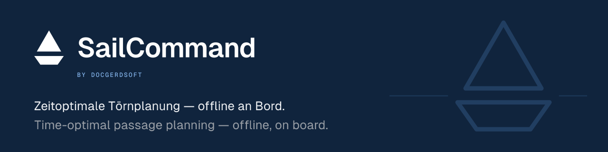
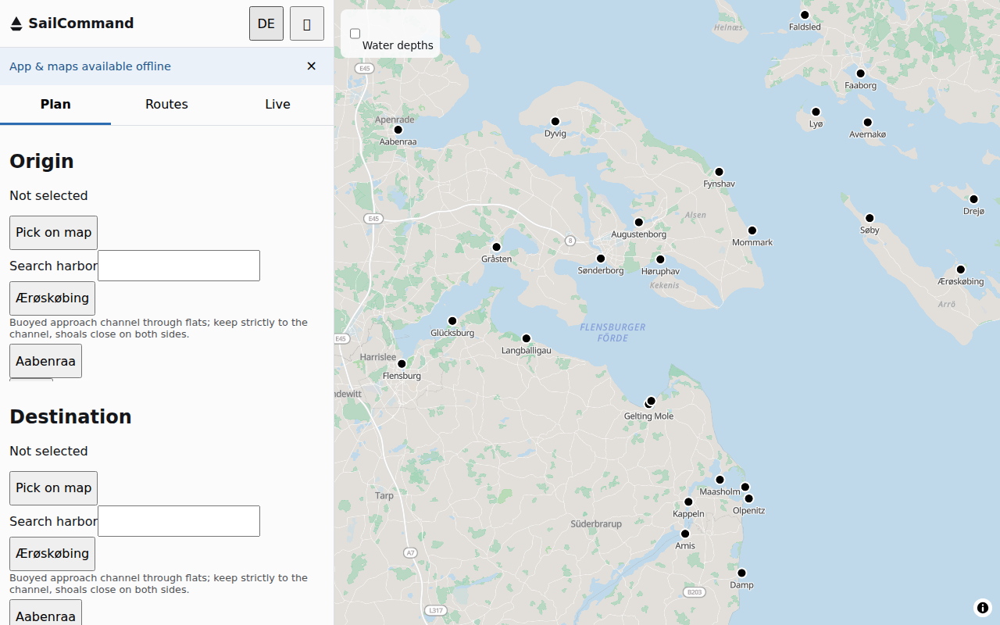
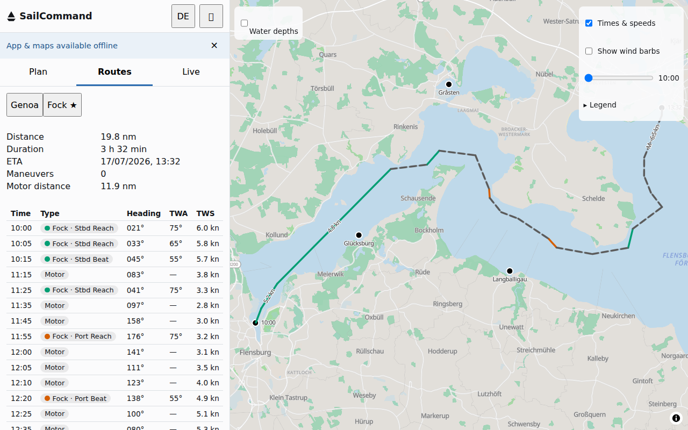
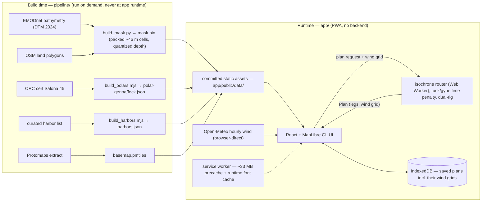

[](https://github.com/DocGerd/sail_command/actions/workflows/ci.yml)
[](https://github.com/DocGerd/sail_command/actions/workflows/codeql.yml)
[](https://scorecard.dev/viewer/?uri=github.com/DocGerd/sail_command)
[](https://www.bestpractices.dev/projects/13749)



# SailCommand

**Zeitoptimale Törnplanung — offline an Bord.** — *Time-optimal passage planning — offline, on board.*

SailCommand plans time-optimal sailing routes for a Salona 45 in the
Flensburg Fjord / Danish South Sea area, using real hourly wind forecasts and
an isochrone router that accounts for tacks and gybes. It runs entirely in
the browser, installs as an offline-capable app on Android, and needs no
account or backend.

> **SailCommand is a passage-planning aid, not a navigation device.** Chart
> data is simplified; official charts and your plotter remain authoritative.
>
> **SailCommand ist eine Törnplanungshilfe, kein Navigationsgerät.**
> Kartendaten sind vereinfacht; maßgeblich bleiben amtliche Seekarten und der
> Plotter.

**Live app:** https://docgerd.github.io/sail_command/

**UAT preview:** https://docgerd.github.io/sail_command/uat/ — the unreleased
`develop` state, auto-deployed on every push. Unstable, `noindex`ed, and not
the productive version; use the live app link above for actual passage
planning.

## Screenshots

| Start view | Planned route |
|---|---|
|  |  |

## Install on Android

Open the live URL in Chrome, then use the browser menu → **Add to Home
screen** (or the install prompt if Chrome offers one automatically). The app
installs as a standalone icon and works fully offline after the first visit
— see [First load / offline](#first-load--offline) below.

## What it does

- Enter a departure and destination — via the curated harbor search, by
  tapping a harbor marker on the map, or by tapping anywhere on the map — and
  pick a departure time within the forecast horizon. A water-depths overlay
  can be toggled on to shade the bathymetry (shallows warm, deep water fading
  out) while you plan.
- The router fetches hourly wind, then computes the fastest sailable route
  twice — once per rig (main+genoa, main+fock) — and recommends the faster
  (marked ★). Tacks and gybes are priced as a time penalty inside the
  routing cost, not bolted on afterwards.
- Land and depth are respected against a configurable safety depth (default
  3.0 m, boat draft 2.1 m). Legs where sailing speed would be too low switch
  to a clearly marked motor leg (gray-dashed on the map).
- Saved plans, including the wind grid they were computed from, persist
  offline in the browser — a saved route always re-renders against the
  forecast it was planned with, never a re-fetched one.
- **Live view**: while underway, GPS position, heading-to-steer, and ETA are
  shown against the active leg of a loaded plan. There is no live re-routing.

Planning a new route requires an internet connection (wind forecast fetch);
everything else — viewing/loading saved plans, the map, live GPS guidance —
works fully offline once the app has been loaded once.

## First load / offline

The first visit precaches roughly **33 MB** (regional basemap tiles,
land/depth mask, polar tables, harbor list, sprites, app shell); the ~11 MB
of map fonts land in a runtime cache in the background after install (#28),
for a total eventual download of ~45 MB. Subsequent visits are served from
the cache and work with no network at all; an update prompt appears when a
new version is available in the background, applied on demand rather than
mid-passage.

## Development

```
npm --prefix app/ install
npm --prefix app/ run dev                        # local dev server
npm --prefix app/ run test                       # unit + property tests, ~4 min
npm --prefix app/ exec playwright install chromium  # one-time E2E browser install
npm --prefix app/ run e2e                        # Playwright E2E (plan flow, offline reload)
npm --prefix app/ run build                      # production build to app/dist
```

`npm run test` runs the full unit/property battery (polar interpolation,
isochrone routing, mask queries, persistence, UI) and takes about 4 minutes.
`npm run e2e` builds the app and drives it with Playwright, including a
true offline reload against a killed preview server.

Timeout policy: solver-heavy test files set generous file-level timeouts
(`vi.setConfig({ testTimeout: 120_000 })`; the seeded property suite carries
900 s) because CI runners are 6–10× slower than dev machines — don't add
tighter per-test timeouts.

## Architecture



## Data pipeline

The static assets under `app/public/data/` (land/depth mask, polar tables,
harbor list) and the regional basemap are produced by build-time scripts in
`pipeline/`, not at app runtime. See [`pipeline/README.md`](pipeline/README.md)
for setup and regeneration instructions.

## Data sources & attribution

- **Bathymetry**: EMODnet Bathymetry Consortium (2024). EMODnet Digital
  Bathymetry (DTM 2024). doi:
  [10.12770/cf51df64-56f9-4a99-b1aa-36b8d7b743a1](https://doi.org/10.12770/cf51df64-56f9-4a99-b1aa-36b8d7b743a1)
  ([CC-BY 4.0](https://creativecommons.org/licenses/by/4.0/)). The data was
  processed (resampled onto the app's ~46 m grid and depth-quantized) for
  this app.
- **Land & Schlei fjord water body**: © OpenStreetMap contributors (ODbL),
  via osmdata.openstreetmap.de land polygons and Nominatim relation
  [2340930](https://www.openstreetmap.org/relation/2340930).
  The land/depth mask (`mask.bin`) is a Derivative Database of OpenStreetMap
  data and is made available under the
  [Open Database License (ODbL)](https://opendatacommons.org/licenses/odbl/1.0/).
  © OpenStreetMap contributors.
- **Basemap rendering**: [Protomaps](https://protomaps.com/), an ODbL
  Produced Work derived from OpenStreetMap data. Map fonts (Noto Sans,
  [SIL OFL 1.1](app/public/basemap-assets/fonts/OFL.txt)) and sprites
  ([MIT](app/public/basemap-assets/sprites/LICENSE.txt), derived from
  [tangrams/icons](https://github.com/tangrams/icons), © 2017 Mapzen) are
  self-hosted from
  [protomaps/basemaps-assets](https://github.com/protomaps/basemaps-assets).
- **Wind forecast**: [Open-Meteo](https://open-meteo.com/) (CC-BY 4.0),
  fetched directly from the browser.
- **Boat polars**: estimate derived from the ORC International 2026
  certificate for Salona 45 "Miles Ahead" (AUT 035/26), with downwind angles
  corrected to white-sails-only (non-spinnaker) performance. This is a
  flat-water racing VPP estimate, tunable via the app's performance factor,
  and explicitly **not** race-calibrated.

Full attribution, including the dynamically-sourced mask citation, is also
shown in the app's About dialog. Data licenses above apply to the underlying
data; the code license is covered in the [License](#license) section below.

## Known limitations

- Only 33 curated harbors are included; a handful of shallow/narrow
  approaches (Schlei fairway, Dyvig channel, Gråsten bridge) remain
  disconnected from the routable mask at sub-cell resolution.
- Map labels (place names) are set once at load time in the UI's active
  language; they don't switch live when you toggle German/English mid-session.
- The router does not yet account for currents, tides, or sea state (waves)
  in the routing cost.

## Out of scope (v1)

Currents/tides, wave data, AIS, live re-routing, multi-day passages beyond
the forecast horizon, route sharing/collaboration, official ENC chart data.

## License

Code is licensed under the [Apache License 2.0](LICENSE). Map tiles and
bathymetry carry their own upstream licenses (OpenStreetMap ODbL, EMODnet
CC-BY 4.0, and others) — see `pipeline/README.md` and the app's About dialog
for the full attribution. Licenses of the bundled runtime JavaScript
dependencies are collected in
[`app/public/THIRD-PARTY-NOTICES.txt`](app/public/THIRD-PARTY-NOTICES.txt),
which also deploys with the site (regenerate via `npm --prefix app run
notices` after dependency bumps).
