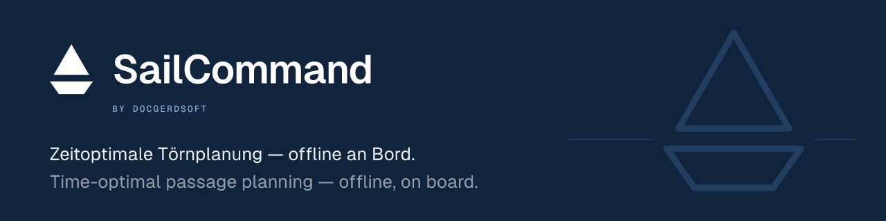
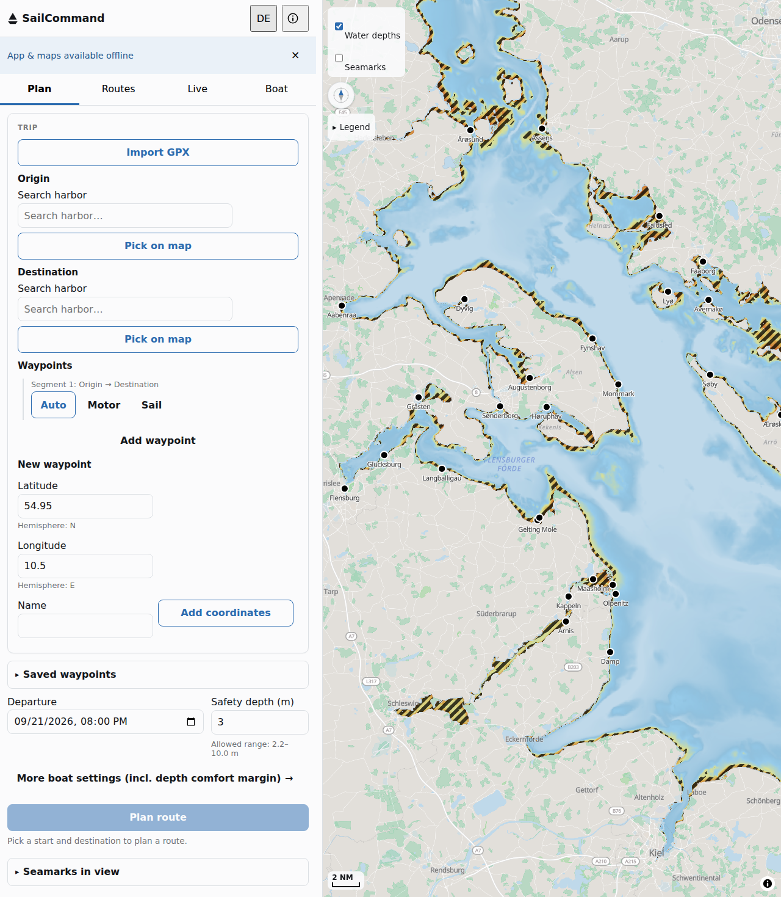
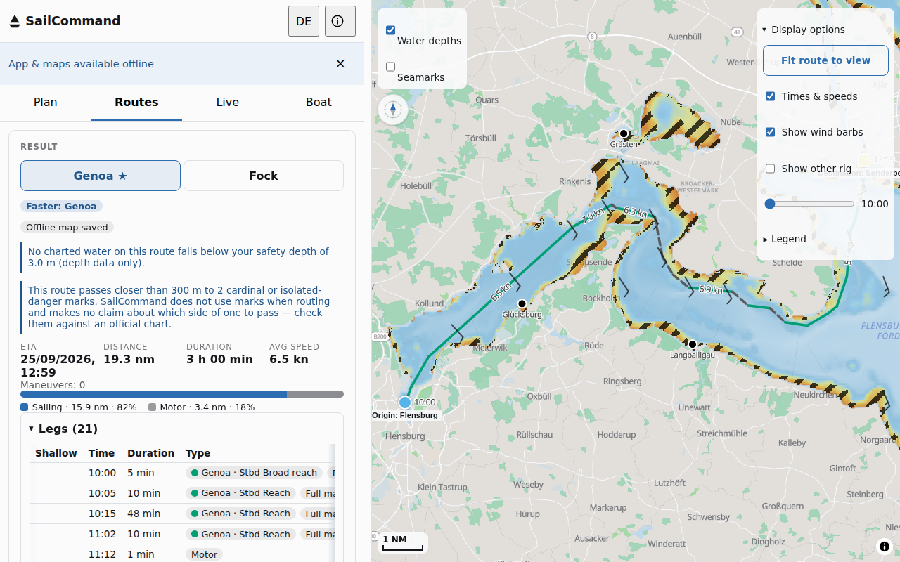
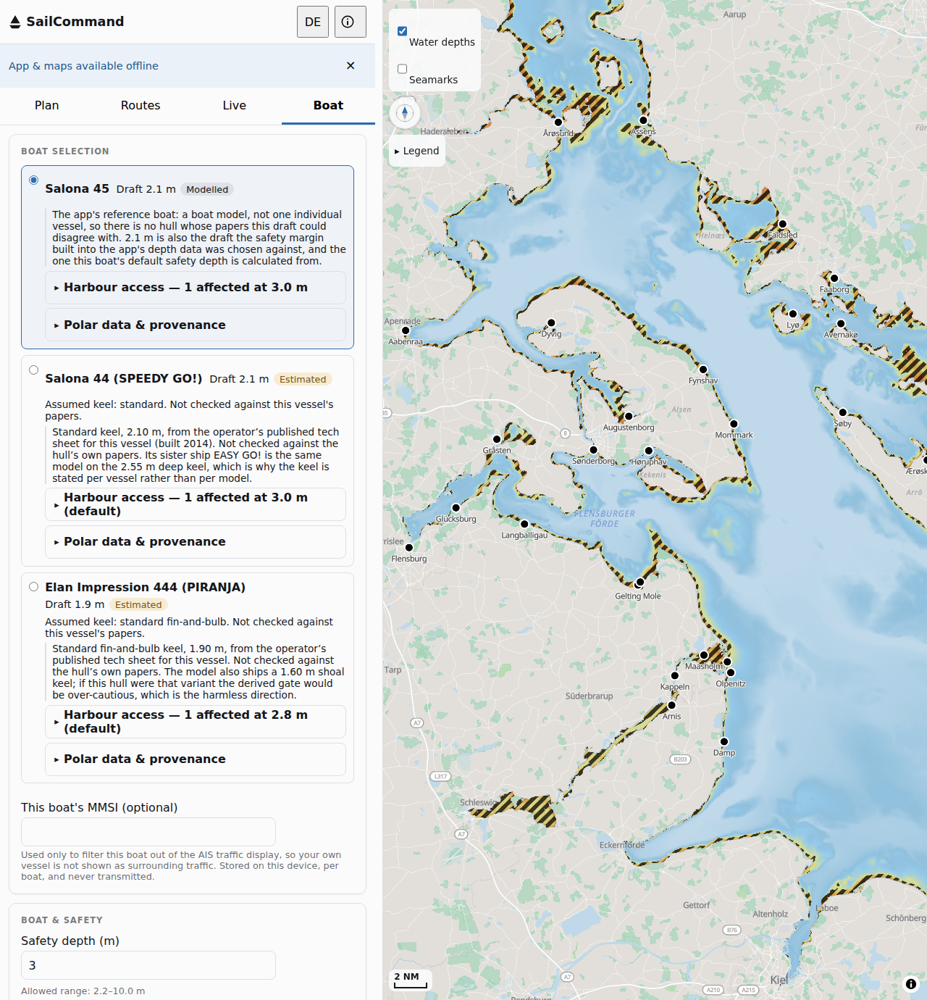
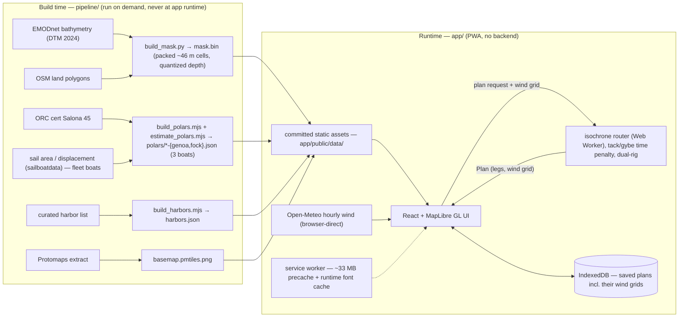

[](https://github.com/DocGerd/sail_command/actions/workflows/ci.yml)
[](https://github.com/DocGerd/sail_command/actions/workflows/codeql.yml)
[](https://codecov.io/gh/DocGerd/sail_command)
[](https://scorecard.dev/viewer/?uri=github.com/DocGerd/sail_command)
[](https://www.bestpractices.dev/projects/13749)



# SailCommand

**Zeitoptimale Törnplanung — offline an Bord.** — *Time-optimal passage planning — offline, on board.*

SailCommand plans time-optimal sailing routes in the Flensburg Fjord /
Danish South Sea area, using real hourly wind forecasts and an isochrone
router that accounts for tacks and gybes. It ships polar tables for three
boats — a Salona 45, a Salona 44 (SPEEDY GO!) and an Elan Impression 444
(PIRANJA) — and routes for whichever one you pick. It runs entirely in the
browser, installs as an offline-capable app on Android, and needs no account
or backend.

> **SailCommand is a passage-planning aid, not a navigation device.** Chart
> data is simplified; official charts and your plotter remain authoritative.
>
> **SailCommand ist eine Törnplanungshilfe, kein Navigationsgerät.**
> Kartendaten sind vereinfacht; maßgeblich bleiben amtliche Seekarten und der
> Plotter.

**Live app:** https://docgerd.github.io/sail_command/

**UAT preview:** https://docgerd.github.io/sail_command/uat/ — the unreleased
`develop` state, auto-deployed on every push. Unstable, `noindex`ed, and not
the productive version; use the live app link above for actual passage
planning.

## Screenshots

| Start view | Planned route |
|---|---|
|  |  |

Picking the boat, with each hull's draft, a provenance chip summarising the
weakest tier across its polar tables (the per-sail tiers are inside the
disclosure); every boat also carries a note on where its stated draft comes
from, and — where the draft is the model's standard keel rather than that
hull's own papers — an additional disclosure saying so:



## Install on Android

Open the live URL in Chrome, then use the browser menu → **Add to Home
screen** (or the install prompt if Chrome offers one automatically). The app
installs as a standalone icon and works fully offline after the first visit
— see [First load / offline](#first-load--offline) below.

## What it does

- Pick the boat you are planning for on the **Boat** tab. Three ship today:
  the Salona 45 (2.1 m draft), the Salona 44 *SPEEDY GO!* (2.1 m) and the
  Elan Impression 444 *PIRANJA* (1.9 m). Each carries its own draft, polar
  tables and foresail inventory; the picker states how good each sail's polar
  data is — *certificate*, *modelled* or *estimated* — and, where the draft is
  the model's standard keel rather than that hull's own papers, says so. The
  choice is remembered on this device.
- Enter a departure and destination — via the curated harbor search, by
  tapping a harbor marker on the map, or by tapping anywhere on the map — and
  pick a departure time within the forecast horizon. A water-depths overlay
  shades the bathymetry while you plan (shallows warm, deep water fading
  out), and hatches water whose cautious, worst-case reading falls below
  your safety depth; it is on by default and can be toggled off. A
  collapsible legend below the map's layer controls, collapsed by default,
  explains what the hatch does and does not mark.
- The router fetches hourly wind, then computes the fastest sailable route
  twice — once per foresail of the selected boat — and recommends the faster
  (marked ★). Where the two tables cannot honestly be ranked it says so
  instead of naming a winner: on the two fleet boats both tables are
  *estimated* and differ only by a documented overlay ramp rather than by
  anything about the hull, so no faster sail is claimed. It says so again when
  the search ran out of time before both sails were compared. Tacks and gybes
  are priced as a time penalty inside the routing cost, not bolted on
  afterwards.
- Land and depth are respected against a configurable safety depth, whose
  default is the selected boat's draft plus the depth mask's 0.9 m tolerance
  — 3.0 m for the 2.1 m-draft Salona 45 and Salona 44, 2.8 m for the 1.9 m
  Elan Impression 444. Switching to a deeper-drafted boat raises the safety
  depth to that boat's minimum and says so; it never lowers a depth you chose
  yourself. Legs where sailing speed would be too low switch to a clearly
  marked motor leg (gray-dashed on the map).
- Saved plans, including the wind grid they were computed from, persist
  offline in the browser — a saved route always re-renders against the
  forecast it was planned with, never a re-fetched one.
- The chart carries a north arrow and a nautical scale bar: tapping the arrow
  switches between north-up and course-up (course-up follows the GPS course
  while under way, holding the last course if the fix drops out), and the
  scale bar re-labels itself in nautical miles, cables, or metres as you zoom.
- **Live view**: while underway, GPS position, heading-to-steer, and ETA
  against the active leg of a loaded plan, plus a short course/speed projection
  on the boat marker. From the current GPS fix you can reroute to the plan's
  destination using the plan's stored forecast — fully offline.
- **AIS traffic** (optional, online-only): paste a personal
  [aisstream.io](https://aisstream.io/) API key in the options to see
  surrounding vessels on the Live view — course/heading, names, tap for details
  — including any within a ±5 nm corridor along the active route. Off by
  default and fully inert without a key; your own vessel is filtered out by MMSI.

Planning a new route requires an internet connection (wind forecast fetch);
everything else — viewing/loading saved plans, the map, live GPS guidance —
works fully offline once the app has been loaded once.

## First load / offline

The first visit precaches roughly **33 MB** (regional basemap tiles,
land/depth mask, polar tables, harbor list, sprites, app shell); the ~11 MB
of map fonts land in a runtime cache in the background after install (#28),
for a total eventual download of ~45 MB. Subsequent visits are served from
the cache and work with no network at all; an update prompt appears when a
new version is available in the background, applied on demand rather than
mid-passage.

## Development

```
npm --prefix app/ install
npm --prefix app/ run dev                        # local dev server
npm --prefix app/ run test                       # unit + property tests
npm --prefix app/ exec playwright install chromium  # one-time E2E browser install
npm --prefix app/ run e2e                        # Playwright E2E (plan flow, offline reload)
npm --prefix app/ run build                      # production build to app/dist
```

`npm run test` runs the full unit/property battery (polar interpolation,
isochrone routing, mask queries, persistence, UI) — 2136 tests across 145
files as of `5b2032d` (2026-08-20).
`npm run e2e` builds the app and drives it with Playwright, including a
true offline reload against a killed preview server.

Timeout policy: solver-heavy test files set generous file-level timeouts
(imported from `app/src/test/timeouts.ts` — `SOLVER_TEST_TIMEOUT_MS`, and the
seeded property suite's 900 s). CI is slower than dev machines, but not by
one flat multiplier:
measured 2026-08-03 (#341) for the vitest unit suite, `npm run test` ran
249.8 s local vs ~515–535 s on CI (~2.1×), and `npm run test:coverage` ran
~983–1029 s local vs 2558 s on CI (~2.5×) — coverage instrumentation is a
separate multiplier from runner speed, not part of a single ratio, and
neither figure is a Playwright/e2e measurement. Don't add tighter per-test
timeouts regardless of the exact ratio.

## Architecture


```mermaid
flowchart LR
  subgraph pipeline ["Build time — pipeline/ (run on demand, never at app runtime)"]
    EMOD["EMODnet bathymetry (DTM 2024)"] --> MASK["build_mask.py → mask.bin (packed ~46 m cells, quantized depth)"]
    OSMLP["OSM land polygons"] --> MASK
    ORC["ORC cert Salona 45"] --> POLARS["build_polars.mjs + estimate_polars.mjs → polars/*-{genoa,fock}.json (3 boats)"]
    SBD["sail area / displacement (sailboatdata) — fleet boats"] --> POLARS
    CUR["curated harbor list"] --> HARB["build_harbors.mjs → harbors.json"]
    PROTO["Protomaps extract"] --> PMT["basemap.pmtiles.png"]
  end
  MASK & POLARS & HARB & PMT --> ASSETS["committed static assets — app/public/data/"]
  subgraph app ["Runtime — app/ (PWA, no backend)"]
    ASSETS --> UI["React + MapLibre GL UI"]
    OM["Open-Meteo hourly wind (browser-direct)"] --> UI
    UI -->|"plan request + wind grid"| WORKER["isochrone router (Web Worker), tack/gybe time penalty, dual-rig"]
    WORKER -->|"Plan (legs, wind grid)"| UI
    UI <--> IDB[("IndexedDB — saved plans incl. their wind grids")]
    SW["service worker — ~33 MB precache + runtime font cache"] -.-> UI
  end
```

## Data pipeline

The static assets under `app/public/data/` (land/depth mask, polar tables,
harbor list) and the regional basemap are produced by build-time scripts in
`pipeline/`, not at app runtime. See [`pipeline/README.md`](pipeline/README.md)
for setup and regeneration instructions.

## Data sources & attribution

- **Bathymetry**: EMODnet Bathymetry Consortium (2024). EMODnet Digital
  Bathymetry (DTM 2024). doi:
  [10.12770/cf51df64-56f9-4a99-b1aa-36b8d7b743a1](https://doi.org/10.12770/cf51df64-56f9-4a99-b1aa-36b8d7b743a1)
  ([CC-BY 4.0](https://creativecommons.org/licenses/by/4.0/)). The data was
  processed (resampled onto the app's ~46 m grid and depth-quantized) for
  this app.
- **Land & Schlei fjord water body**: © OpenStreetMap contributors (ODbL),
  via osmdata.openstreetmap.de land polygons and Nominatim relation
  [2340930](https://www.openstreetmap.org/relation/2340930).
  The land/depth mask (`mask.bin`) is a Derivative Database of OpenStreetMap
  data and is made available under the
  [Open Database License (ODbL)](https://opendatacommons.org/licenses/odbl/1.0/).
  © OpenStreetMap contributors.
- **Basemap rendering**: [Protomaps](https://protomaps.com/), an ODbL
  Produced Work derived from OpenStreetMap data. Map fonts (Noto Sans,
  [SIL OFL 1.1](app/public/basemap-assets/fonts/OFL.txt)) and sprites
  ([MIT](app/public/basemap-assets/sprites/LICENSE.txt), derived from
  [tangrams/icons](https://github.com/tangrams/icons), © 2017 Mapzen) are
  self-hosted from
  [protomaps/basemaps-assets](https://github.com/protomaps/basemaps-assets).
- **Wind forecast**: [Open-Meteo](https://open-meteo.com/) (CC-BY 4.0),
  fetched directly from the browser.
- **Boat polars (Salona 45)**: estimate derived from the ORC International
  2026 certificate for Salona 45 "Miles Ahead" (AUT 035/26), with downwind
  angles corrected to white-sails-only (non-spinnaker) performance.
- **Boat polars (Salona 44 SPEEDY GO!, Elan Impression 444 PIRANJA)**:
  **estimated, not measured**. No ORC/IRC certificate and no published VPP
  was obtained for either hull, so each table is the Salona 45's
  certificate-anchored jib table scaled by one uniform hull scalar — the
  square root of the two hulls' sail-area/displacement ratios
  (figures from [sailboatdata.com](https://sailboatdata.com/)), with the
  Salona 45's TWA/TWS grid and pointing angles inherited unchanged. Speeds
  are typically within a few percent, up to about ten percent in individual
  conditions; on the Elan's fock that error is called out as large enough
  in light air to flip a leg between sail and motor.

  All of the above are flat-water racing VPP estimates, tunable via the app's
  performance factor, and explicitly **not** race-calibrated; each table
  states its own provenance in the app.

Full attribution, including the dynamically-sourced mask citation, is also
shown in the app's About dialog. Data licenses above apply to the underlying
data; the code license is covered in the [License](#license) section below.

## Known limitations

- Only 33 curated harbors are included; a handful of shallow/narrow
  approaches (Schlei fairway, Dyvig channel, Gråsten bridge) remain
  disconnected from the routable mask at sub-cell resolution.
- The depth mask can read deeper than the survey supports: a route that
  stays inside your safety depth can still cross water that a more cautious
  reading of the same bathymetry puts below it. The app says how far, per
  route, on both the Plan and Routes tabs. Unsurveyed and drying water
  carries no hatching at all and looks like ordinary water, so absent
  hatching is not a guarantee the water is clear
  ([#455](https://github.com/DocGerd/sail_command/issues/455),
  [#597](https://github.com/DocGerd/sail_command/issues/597)).
- Two of the three boats — the Salona 44 *SPEEDY GO!* and the Elan Impression
  444 *PIRANJA* — carry **estimated** polar tables scaled from the Salona 45's
  certificate rather than measured data, and their drafts are the model's
  published keel rather than that hull's own papers; the app states both, per
  boat, on the Boat tab. Because their two foresail tables differ only by a
  documented overlay ramp, no faster-sail recommendation is made for them.
  Deeper-drafted fleet boats are not in the catalogue yet: they can no longer
  reach every harbor, and the picker does not yet grey unreachable harbors out
  per boat.
- Map labels (place names) are set once at load time in the UI's active
  language; they don't switch live when you toggle German/English mid-session.
- The router does not yet account for currents, tides, or sea state (waves)
  in the routing cost.
- On some short, narrow **portrait** phone viewports, the top-left chrome
  (layer toggles + compass) and the bottom sheet leave no room for the
  scale bar, so it is suppressed rather than drawn over other controls —
  deliberate: drawing it in the wrong place would be worse. Short
  **landscape** phones were freed of the no-banner case in `v0.11.0`
  ([#231](https://github.com/DocGerd/sail_command/issues/231)), which
  compacted the top-left chrome into a row there, and of the single-line
  banner case in `v0.12.1`
  ([#441](https://github.com/DocGerd/sail_command/issues/441)); two or more
  banners stacked at once, or a banner that wraps to two lines, can still
  suppress it there.

## Out of scope (v1)

Currents/tides, wave data, multi-day passages beyond the forecast horizon,
route sharing/collaboration, official ENC chart data.

## Project documents

- [**Roadmap**](ROADMAP.md) — what the project intends to do, and what it
  deliberately will not do. Intent, not commitment.
- [**Governance**](GOVERNANCE.md) — how decisions are made, who holds which
  role, and what a successor would need. SailCommand has a single maintainer;
  the bus factor is 1 and that document says so plainly.
- [**Contributing**](CONTRIBUTING.md) — ground rules, development commands,
  labels and milestones. Contributions are inbound-equals-outbound under
  Apache-2.0 §5; there is no CLA and no DCO sign-off.
- [**Code of Conduct**](CODE_OF_CONDUCT.md) — Contributor Covenant 2.1.
- [**Security policy**](SECURITY.md) — what you can and cannot expect in terms
  of security, how to report a vulnerability, and what happens next. The
  reasoning behind those claims — threat model, trust boundaries, and the
  weaknesses walk — is in the
  [security assurance case](docs/security-assurance-case.md).
- [**Changelog**](CHANGELOG.md) — what shipped, per release.

## License

Code is licensed under the [Apache License 2.0](LICENSE). Map tiles and
bathymetry carry their own upstream licenses (OpenStreetMap ODbL, EMODnet
CC-BY 4.0, and others) — see `pipeline/README.md` and the app's About dialog
for the full attribution. Licenses of the bundled runtime JavaScript
dependencies are collected in
[`app/public/THIRD-PARTY-NOTICES.txt`](app/public/THIRD-PARTY-NOTICES.txt),
which also deploys with the site (regenerate via `npm --prefix app run
notices` after dependency bumps).
