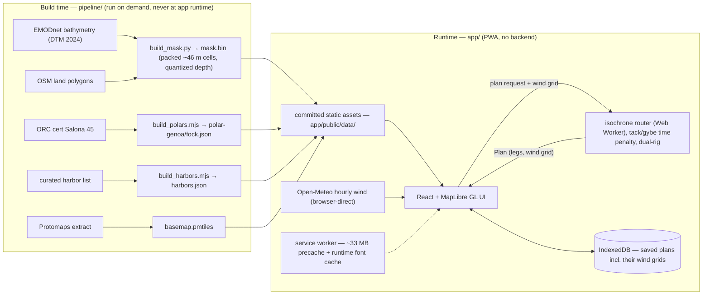

# Public Readiness v0.1.2 Implementation Plan

> **For agentic workers:** REQUIRED SUB-SKILL: Use superpowers:subagent-driven-development (recommended) or superpowers:executing-plans to implement this plan task-by-task. Steps use checkbox (`- [ ]`) syntax for tracking.

**Goal:** Close the public-readiness batch (#10, #12, #13, #14, #16) on the already-public repo: community health files + README gaps, CodeQL, Dependabot, CI hardening + Scorecard, and the umbrella close-out.

**Architecture:** Five serial PRs, one per issue, ordered so each later PR builds on the earlier ones (#12's CodeQL workflow is written SHA-pinned/least-privilege from the start so #14 never has to touch it; #13's `github-actions` ecosystem keeps #14's SHA pins maintained). No app code changes anywhere in this plan — the required `app` + `e2e` checks must stay green untouched.

**Tech Stack:** GitHub Actions, CodeQL (advanced setup), Dependabot, OpenSSF Scorecard, gitleaks, Markdown/Mermaid, Playwright (screenshots only).

## Global Constraints

- Repo: `DocGerd/sail_command`, default branch `main`, guarded by `protect-main` ruleset: PR-only merges (merge commits), review threads resolved, required checks **`app` + `e2e`** with strict up-to-date policy. **Never rename the `app` or `e2e` job ids in `ci.yml`** — they are the required-check names.
- Merge strictly serially. After each merge, `git merge origin/main` into the next branch and let full CI (~10 min) re-run before its merge.
- Never use `--force`, `-f`, `--no-verify` on git. The destructive-git guard pattern-matches `-f` anywhere in a compound command: **never combine `gh api -f …` with any `git` command in one Bash call** — split them.
- `gh issue view` / `gh pr view` / `gh pr edit` hit the Projects-classic GraphQL bug — use `gh api repos/DocGerd/sail_command/...` REST calls instead. PR bodies with backticks go via `--input <json-file>`.
- New workflows (`codeql.yml`, `verify-mask.yml`, `scorecard.yml`) must **NOT** be added to the ruleset's required checks — path-filtered/scheduled jobs would block unrelated PRs under the strict policy.
- Every new workflow: top-level `permissions: contents: read` (job-level elevation only where needed) and every `uses:` pinned to a full commit SHA with a `# vX.Y.Z` comment (Dependabot-maintainable).
- Action pins resolved 2026-07-17 (re-verify with the command in Task 2/4 if re-planning later):
  - `actions/checkout` v7.0.0 → `9c091bb21b7c1c1d1991bb908d89e4e9dddfe3e0`
  - `actions/setup-node` v7.0.0 → `820762786026740c76f36085b0efc47a31fe5020`
  - `actions/upload-artifact` v7.0.1 → `043fb46d1a93c77aae656e7c1c64a875d1fc6a0a`
  - `actions/upload-pages-artifact` v5.0.0 → `fc324d3547104276b827a68afc52ff2a11cc49c9`
  - `actions/deploy-pages` v5.0.0 → `cd2ce8fcbc39b97be8ca5fce6e763baed58fa128`
  - `actions/setup-python` v6.3.0 → `ece7cb06caefa5fff74198d8649806c4678c61a1`
  - `github/codeql-action` v4 → `7188fc363630916deb702c7fdcf4e481b751f97a`
  - `ossf/scorecard-action` v2.4.3 → `4eaacf0543bb3f2c246792bd56e8cdeffafb205a`
- User-facing app copy is out of scope; README/docs stay bilingual only where they already are. The "not a navigation device" disclaimer must never be weakened.
- The `pipeline/data-src/` download cache (~888 MB, gitignored) must never be deleted.
- CI runners are 6–10× slower than dev machines — never tighten timeouts.

---

### Task 1: PR 1 — Community health files + README gaps (`Closes #10`)

**Files:**
- Create: `SECURITY.md`
- Create: `CONTRIBUTING.md`
- Create: `docs/screenshots/capture.mjs`, `docs/screenshots/plan-route.png`, `docs/screenshots/start-view.png`
- Modify: `README.md` (screenshots section, architecture sketch, test-policy note)
- Commit (ride-along): `docs/superpowers/plans/2026-07-17-public-readiness-v012.md` (this plan)

**Interfaces:**
- Produces: `SECURITY.md` referencing GitHub private vulnerability reporting (Task 1 enables the repo setting); `README.md` section anchors `## Screenshots`, `## Architecture` (Task 4 adds badges above the title block).

- [ ] **Step 1: Branch**

```bash
git switch -c feat/10-community-health
```

- [ ] **Step 2: Enable private vulnerability reporting (repo setting, required BEFORE SECURITY.md may promise the channel)**

```bash
gh api --method PUT repos/DocGerd/sail_command/private-vulnerability-reporting
gh api repos/DocGerd/sail_command/private-vulnerability-reporting --jq .enabled
```
Expected: first command returns HTTP 204 (empty), second prints `true`.

- [ ] **Step 3: Write `SECURITY.md`**

```markdown
# Security Policy

## Supported versions

SailCommand is a client-only PWA with no backend and no accounts. The only
supported version is the latest deployment at
<https://docgerd.github.io/sail_command/> (built from `main`). Older
service-worker caches self-update on the next online visit.

## Reporting a vulnerability

Please report vulnerabilities privately via GitHub:
**[Report a vulnerability](https://github.com/DocGerd/sail_command/security/advisories/new)**
(Security tab → "Report a vulnerability"). Do not open a public issue for
anything exploitable.

You can expect an acknowledgment within 7 days. Coordinated disclosure is
appreciated; there is no bug-bounty program.

## Scope notes

- All user data (saved plans, wind grids, settings) stays in the browser
  (IndexedDB / localStorage). The app makes exactly one class of runtime
  network request beyond same-origin asset fetches: wind forecasts from
  Open-Meteo, called directly from the browser.
- The deployed site is static (GitHub Pages). Supply-chain reports about
  bundled dependencies are in scope; see
  `app/public/THIRD-PARTY-NOTICES.txt` for the inventory.
```

- [ ] **Step 4: Write `CONTRIBUTING.md`**

```markdown
# Contributing

SailCommand is a small personal project; issues and PRs are welcome but
review capacity is limited.

## Ground rules

- **`main` is protected**: PR-only merges (merge commits), required checks
  `app` + `e2e` must pass, review threads must be resolved, strict
  up-to-date policy (rebase/merge `main` before merging).
- **No backend.** The app is deliberately client-only; features that need a
  server (proxies, token exchanges, databases) will be declined.
- **Offline first.** Planning a route needs network (wind fetch); everything
  else must keep working offline. A feature that silently assumes
  connectivity is a bug.
- **Not a navigation device.** User-facing copy must never claim chart
  authority.

## Development

See [README → Development](README.md#development). Quick reference:

- `npm --prefix app run lint` / `typecheck` / `test` / `build` / `e2e`
- CI runs lint + typecheck before tests — vitest alone will not catch
  unused imports or type errors.
- The full unit/property suite takes ~4 min (a ~200 s seeded fast-check
  property file and a ~40 s real-mask solver acceptance file are expected).
  CI runners are 6–10× slower than dev machines: never add a per-test
  timeout tighter than the file-level `vi.setConfig` values.
- UI strings go through the i18n dictionaries (`de` + `en`); key parity is
  type-enforced — add every key to BOTH dicts.
- TypeScript `strict` + `exactOptionalPropertyTypes` are on; enums are
  forbidden (`erasableSyntaxOnly`).

## Data pipeline

`pipeline/` regenerates the committed static assets (mask, polars, harbors,
basemap). It downloads ~900 MB of source data into `pipeline/data-src/`
(gitignored, cached — don't delete it casually). `verify_mask.py` must exit
0 before committing a rebuilt mask. See `pipeline/README.md`.

## Design spec

`docs/superpowers/specs/2026-07-14-sail-command-design.md` is the source of
truth for design-level decisions — PRs that silently deviate from it will
be asked to update the spec discussion first.
```

- [ ] **Step 5: Capture the two README screenshots**

Write `docs/screenshots/capture.mjs` (standalone Playwright script; uses the chromium already installed for e2e). **Before running, cross-check the selector strings against `app/e2e/helpers.ts` / the e2e specs — they are the canonical source; adjust the constants at the top of the script if they drifted.**

```js
// docs/screenshots/capture.mjs — README screenshot capture (manual, not CI).
// Run: node docs/screenshots/capture.mjs  (needs network: live app + wind fetch)
import { chromium } from '@playwright/test';

const APP = 'https://docgerd.github.io/sail_command/';
const START_HARBOR = 'Flensburg';
const DEST_HARBOR = 'Sønderborg';

const browser = await chromium.launch();
const page = await browser.newPage({ viewport: { width: 1280, height: 800 } });
await page.goto(APP, { waitUntil: 'networkidle' });
// Switch UI to English for the README's international audience.
await page.getByRole('button', { name: 'EN' }).click();
await page.waitForTimeout(2000); // map tile settle for a static capture is fine here (not a test)
await page.screenshot({ path: 'docs/screenshots/start-view.png' });

// Plan flow — selector names per app/e2e helpers (verify before running).
await page.getByPlaceholder(/search harbor/i).fill(START_HARBOR);
await page.getByRole('button', { name: new RegExp(START_HARBOR) }).first().click();
await page.getByPlaceholder(/search harbor/i).fill(DEST_HARBOR);
await page.getByRole('button', { name: new RegExp(DEST_HARBOR) }).first().click();
await page.getByRole('button', { name: /plan route/i }).click();
// Wait for the route summary (rig recommendation star) to appear.
await page.getByText('★').first().waitFor({ timeout: 120_000 });
await page.waitForTimeout(2000);
await page.screenshot({ path: 'docs/screenshots/plan-route.png' });
await browser.close();
```

Run: `node --experimental-vm-modules docs/screenshots/capture.mjs` — plain `node docs/screenshots/capture.mjs` is fine on Node 22 (ESM by extension). If `@playwright/test` isn't resolvable from repo root, run `NODE_PATH=app/node_modules node docs/screenshots/capture.mjs`.
Expected: two PNGs in `docs/screenshots/`, each showing map + UI (start view; planned route with legs and summary). Eyeball both images before committing (no personal data on screen; route actually rendered). If the plan-flow selectors resist quick fixing, fall back to a hand-driven capture via the Playwright MCP browser at the same viewport, saving the same two filenames.

- [ ] **Step 6: README additions**

Insert after the "Live app" line (`README.md:20`):

```markdown

## Screenshots

| Start view | Planned route |
|---|---|
|  |  |
```

Insert a new section between "Development" and "Data pipeline" (`README.md:78`). Note the 4-backtick outer fence below exists only so this plan renders; in README.md the mermaid block uses normal 3-backtick fencing:

````markdown
## Architecture


````

Append to the paragraph after the Development code block (`README.md:74-77`):

```markdown
Timeout policy: solver-heavy test files set generous file-level timeouts
(`vi.setConfig({ testTimeout: 120_000 })`; the seeded property suite carries
900 s) because CI runners are 6–10× slower than dev machines — don't add
tighter per-test timeouts.
```

- [ ] **Step 7: Sanity-check rendering + commit**

```bash
npx --yes markdownlint-cli2 README.md SECURITY.md CONTRIBUTING.md || true   # advisory only, no config in repo
git add README.md SECURITY.md CONTRIBUTING.md docs/screenshots/ docs/superpowers/plans/2026-07-17-public-readiness-v012.md
git commit -m "docs: README screenshots + architecture sketch, add SECURITY.md and CONTRIBUTING.md (#10)"
```

- [ ] **Step 8: Push + PR**

```bash
git push -u origin feat/10-community-health
```

PR via `gh pr create --title "docs: community health files + README gaps" --body-file <file>`; body must contain `Closes #10`, a summary, and the standard footer `🤖 Generated with [Claude Code](https://claude.com/claude-code)`. Mermaid + screenshot rendering must be eyeballed on the PR's "Files changed" rich diff before review sign-off.

---

### Task 2: PR 2 — CodeQL code scanning (`Closes #12`)

**Files:**
- Create: `.github/workflows/codeql.yml`

**Interfaces:**
- Produces: workflow named `CodeQL` with job id `analyze` — must NOT be added to required checks. Written SHA-pinned + least-privilege from the start so Task 4 does not have to touch it.

- [ ] **Step 1: Branch from fresh main**

```bash
git switch main
git pull
git switch -c feat/12-codeql
```

- [ ] **Step 2: Write `.github/workflows/codeql.yml`**

```yaml
name: CodeQL
on:
  push:
    branches: [main]
  pull_request:
    branches: [main]
  schedule:
    - cron: '23 4 * * 1' # weekly, Monday 04:23 UTC
permissions:
  contents: read
jobs:
  analyze:
    name: Analyze (${{ matrix.language }})
    runs-on: ubuntu-latest
    permissions:
      contents: read
      security-events: write
    strategy:
      fail-fast: false
      matrix:
        include:
          - language: javascript-typescript
            build-mode: none
          - language: python
            build-mode: none
    steps:
      - uses: actions/checkout@9c091bb21b7c1c1d1991bb908d89e4e9dddfe3e0 # v7.0.0
      - uses: github/codeql-action/init@7188fc363630916deb702c7fdcf4e481b751f97a # v4
        with:
          languages: ${{ matrix.language }}
          build-mode: ${{ matrix.build-mode }}
      - uses: github/codeql-action/analyze@7188fc363630916deb702c7fdcf4e481b751f97a # v4
        with:
          category: '/language:${{ matrix.language }}'
```

- [ ] **Step 3: Verify the SHA pins still match their tags (they were resolved 2026-07-17)**

```bash
gh api repos/actions/checkout/git/ref/tags/v7.0.0 --jq .object.sha
gh api repos/github/codeql-action/git/ref/tags/v4 --jq '.object.sha'
```
Expected: first prints a sha; if it is an annotated tag object, dereference with `gh api repos/actions/checkout/git/tags/<sha> --jq .object.sha`. Final commit SHAs must equal the ones in the file (`9c091bb2…`, `7188fc36…`); if not, update the file to the freshly-resolved SHAs and comments.

- [ ] **Step 4: Commit, push, PR**

```bash
git add .github/workflows/codeql.yml
git commit -m "ci: add CodeQL scanning (JS/TS + Python), SHA-pinned, least-privilege (#12)"
git push -u origin feat/12-codeql
```

PR body: `Closes #12`, note that the workflow is deliberately NOT a required check. The PR itself triggers the first CodeQL run (`pull_request` → `main`) — **wait for both matrix legs to succeed before merge**; that is the acceptance evidence.

- [ ] **Step 5: Post-merge triage**

After merge, list open alerts:

```bash
gh api repos/DocGerd/sail_command/code-scanning/alerts --jq '.[] | {number, rule: .rule.id, severity: .rule.severity, path: .most_recent_instance.location.path}'
```
Expected: likely empty. Every alert that does appear gets fixed (follow-up commit on the NEXT task's branch is not allowed — file a fresh issue or a dedicated PR) or dismissed with a written reason. Record the outcome as a comment on #12 before closing (auto-close via PR keeps it closed; the comment is the triage record).

---

### Task 3: PR 3 — Dependabot (`Closes #13`)

**Files:**
- Create: `.github/dependabot.yml`

**Interfaces:**
- Consumes: nothing from earlier tasks (independent file).
- Produces: `github-actions` ecosystem entry that keeps Task 2/4 SHA pins updated (Dependabot rewrites pinned SHAs and their `# vX.Y.Z` comments).

- [ ] **Step 1: Branch from fresh main**

```bash
git switch main
git pull
git switch -c feat/13-dependabot
```

- [ ] **Step 2: Write `.github/dependabot.yml`**

Rationale encoded below: weekly grouped minor+patch to keep PR noise low under the ~10-min serial-merge policy; majors excluded from groups so they arrive as individual, carefully-reviewed PRs; deliberate pins protected via `ignore`. `open-pull-requests-limit` kept small — every bot PR runs the full required `app`+`e2e` suite.

```yaml
version: 2
updates:
  - package-ecosystem: npm
    directory: /app
    schedule:
      interval: weekly
      day: monday
    open-pull-requests-limit: 3
    groups:
      app-minor-patch:
        applies-to: version-updates
        patterns: ['*']
        update-types: [minor, patch]
    ignore:
      # Deliberate exact pin — TS minors routinely break strict builds; bump manually.
      - dependency-name: typescript
      # Majors reshape the seeded fast-check property suite / test infra — manual only.
      - dependency-name: fast-check
        update-types: [version-update:semver-major]
      - dependency-name: vitest
        update-types: [version-update:semver-major]
      - dependency-name: '@vitest/*'
        update-types: [version-update:semver-major]
      - dependency-name: '@playwright/test'
        update-types: [version-update:semver-major]
      # Exact-pinned runtime stack — majors are a deliberate migration, not a bot PR.
      - dependency-name: react
        update-types: [version-update:semver-major]
      - dependency-name: react-dom
        update-types: [version-update:semver-major]
      - dependency-name: 'workbox-*'
        update-types: [version-update:semver-major]
  - package-ecosystem: npm
    directory: /pipeline
    schedule:
      interval: weekly
      day: monday
    open-pull-requests-limit: 2
    groups:
      pipeline-npm-minor-patch:
        applies-to: version-updates
        patterns: ['*']
        update-types: [minor, patch]
  - package-ecosystem: pip
    directory: /pipeline
    schedule:
      interval: weekly
      day: monday
    open-pull-requests-limit: 2
    groups:
      pipeline-pip-minor-patch:
        applies-to: version-updates
        patterns: ['*']
        update-types: [minor, patch]
  - package-ecosystem: github-actions
    directory: /
    schedule:
      interval: weekly
      day: monday
    open-pull-requests-limit: 2
    groups:
      actions-all:
        applies-to: version-updates
        patterns: ['*']
```

- [ ] **Step 3: Enable Dependabot alerts + security updates (repo settings; separate calls, no git in these commands)**

```bash
gh api --method PUT repos/DocGerd/sail_command/vulnerability-alerts
gh api --method PUT repos/DocGerd/sail_command/automated-security-fixes
```
Expected: HTTP 204 each. Verify:

```bash
gh api repos/DocGerd/sail_command --jq .security_and_analysis.dependabot_security_updates.status
```
Expected: `enabled`.

- [ ] **Step 4: Commit, push, PR**

```bash
git add .github/dependabot.yml
git commit -m "ci: Dependabot for app npm, pipeline npm+pip, actions — weekly, grouped, pins guarded (#13)"
git push -u origin feat/13-dependabot
```

PR body: `Closes #13`; call out the pin-guard ignores (typescript full-ignore; majors of fast-check/vitest/playwright/react/workbox) and that pip bumps stay effectively unverified by CI until #14's mask job lands (next PR). After merge, confirm Dependabot parsed the config: `gh api repos/DocGerd/sail_command/dependabot/alerts --jq length` returns without error (alerts list may be empty) and the Insights → Dependency graph → Dependabot tab shows the four ecosystems (manual check, or wait for the first weekly run).

---

### Task 4: PR 4 — CI hardening + Scorecard (`Closes #14`)

**Files:**
- Modify: `.github/workflows/ci.yml` (permissions, concurrency, SHA pins; **job ids `app`/`e2e` unchanged**)
- Modify: `.github/workflows/deploy.yml` (job-level permission split, SHA pins)
- Create: `.github/workflows/verify-mask.yml`
- Create: `.github/workflows/scorecard.yml`
- Modify: `README.md` (badges above title block)

**Interfaces:**
- Consumes: Task 2's `codeql.yml` is already compliant — do not modify it. Task 3's `github-actions` Dependabot entry maintains the pins added here.
- Produces: workflows `Mask integrity` (job id `verify`) and `Scorecard` (job id `analysis`) — neither becomes a required check.

- [ ] **Step 1: Branch from fresh main**

```bash
git switch main
git pull
git switch -c feat/14-ci-hardening
```

- [ ] **Step 2: Rewrite `.github/workflows/ci.yml` (full replacement; job ids preserved)**

```yaml
name: CI
on:
  pull_request:
  push:
    branches: [main]
permissions:
  contents: read
concurrency:
  # Cancel superseded runs on PRs only; pushes to main always run to completion.
  group: ci-${{ github.ref }}
  cancel-in-progress: ${{ github.event_name == 'pull_request' }}
jobs:
  app:
    runs-on: ubuntu-latest
    defaults: { run: { working-directory: app } }
    steps:
      - uses: actions/checkout@9c091bb21b7c1c1d1991bb908d89e4e9dddfe3e0 # v7.0.0
      - uses: actions/setup-node@820762786026740c76f36085b0efc47a31fe5020 # v7.0.0
        with: { node-version: 22, cache: npm, cache-dependency-path: app/package-lock.json }
      - run: npm ci
      - run: npm run lint
      - run: npm run typecheck
      - run: npm run test
      - run: npm run build
      # Drift guard: a dependency bump that forgets to regenerate the
      # committed third-party notices fails CI. Pathspec is relative to the
      # job's working-directory (app/).
      - run: npm run notices
      - run: git diff --exit-code public/THIRD-PARTY-NOTICES.txt
  e2e:
    needs: app
    runs-on: ubuntu-latest
    defaults: { run: { working-directory: app } }
    steps:
      - uses: actions/checkout@9c091bb21b7c1c1d1991bb908d89e4e9dddfe3e0 # v7.0.0
      - uses: actions/setup-node@820762786026740c76f36085b0efc47a31fe5020 # v7.0.0
        with: { node-version: 22, cache: npm, cache-dependency-path: app/package-lock.json }
      - run: npm ci
      - run: npx playwright install --with-deps chromium
      - run: npm run e2e
      - uses: actions/upload-artifact@043fb46d1a93c77aae656e7c1c64a875d1fc6a0a # v7.0.1
        if: failure()
        with:
          name: playwright-report
          path: app/playwright-report/
          retention-days: 7
```

- [ ] **Step 3: Rewrite `.github/workflows/deploy.yml` (least-privilege split: build inherits read-only, only deploy elevates)**

```yaml
name: Deploy
on:
  push:
    branches: [main]
permissions:
  contents: read
concurrency: { group: pages, cancel-in-progress: true }
jobs:
  build:
    runs-on: ubuntu-latest
    steps:
      - uses: actions/checkout@9c091bb21b7c1c1d1991bb908d89e4e9dddfe3e0 # v7.0.0
      - uses: actions/setup-node@820762786026740c76f36085b0efc47a31fe5020 # v7.0.0
        with: { node-version: 22, cache: npm, cache-dependency-path: app/package-lock.json }
      - run: npm ci
        working-directory: app
      - run: npm run build
        working-directory: app
      - uses: actions/upload-pages-artifact@fc324d3547104276b827a68afc52ff2a11cc49c9 # v5.0.0
        with: { path: app/dist }
  deploy:
    needs: build
    runs-on: ubuntu-latest
    permissions:
      pages: write
      id-token: write
    environment: { name: github-pages, url: "${{ steps.deployment.outputs.page_url }}" }
    steps:
      - id: deployment
        uses: actions/deploy-pages@cd2ce8fcbc39b97be8ca5fce6e763baed58fa128 # v5.0.0
```

- [ ] **Step 4: Rehearse the slim mask check locally (venv OUTSIDE the repo — a stray venv in pipeline/ would dirty the worktree)**

```bash
python3 -m venv /tmp/claude-1000/-home-pkuhn-sail-command/91f5c167-e600-413c-8427-4319b7f088f3/scratchpad/slimvenv
/tmp/claude-1000/-home-pkuhn-sail-command/91f5c167-e600-413c-8427-4319b7f088f3/scratchpad/slimvenv/bin/pip install numpy==2.5.1 scipy==1.18.0
cd /home/pkuhn/sail_command/pipeline && /tmp/claude-1000/-home-pkuhn-sail-command/91f5c167-e600-413c-8427-4319b7f088f3/scratchpad/slimvenv/bin/python verify_mask.py; cd /home/pkuhn/sail_command
```
Expected: exit 0, output ends with the harbor-connectivity summary (KNOWN_DISCONNECTED allowlist entries reported as expected). This proves numpy+scipy suffice — `verify_mask.py` imports only `json/pathlib/sys/numpy/scipy.ndimage`. If it needs more, extend the pip list in Step 5 to match, never install the full geo stack.

- [ ] **Step 5: Write `.github/workflows/verify-mask.yml` (path-filtered; NOT a required check, so skipped runs can never block unrelated PRs)**

```yaml
name: Mask integrity
on:
  pull_request:
    paths:
      - 'pipeline/**'
      - 'app/public/data/**'
      - '.github/workflows/verify-mask.yml'
  push:
    branches: [main]
    paths:
      - 'pipeline/**'
      - 'app/public/data/**'
      - '.github/workflows/verify-mask.yml'
permissions:
  contents: read
jobs:
  verify:
    runs-on: ubuntu-latest
    defaults: { run: { working-directory: pipeline } }
    steps:
      - uses: actions/checkout@9c091bb21b7c1c1d1991bb908d89e4e9dddfe3e0 # v7.0.0
      - uses: actions/setup-python@ece7cb06caefa5fff74198d8649806c4678c61a1 # v6.3.0
        with: { python-version: '3.12' }
      # Slim on purpose: verify_mask.py flood-fills the COMMITTED mask
      # (app/public/data/mask.bin) — no rebuild, no geo stack.
      - run: pip install numpy==2.5.1 scipy==1.18.0
      - run: python verify_mask.py
```

- [ ] **Step 6: Write `.github/workflows/scorecard.yml`**

```yaml
name: Scorecard
on:
  push:
    branches: [main]
  schedule:
    - cron: '30 3 * * 1' # weekly, Monday 03:30 UTC
  branch_protection_rule:
permissions: read-all
jobs:
  analysis:
    runs-on: ubuntu-latest
    permissions:
      security-events: write # upload SARIF to code scanning
      id-token: write        # publish_results signed attestation
    steps:
      - uses: actions/checkout@9c091bb21b7c1c1d1991bb908d89e4e9dddfe3e0 # v7.0.0
        with:
          persist-credentials: false
      - uses: ossf/scorecard-action@4eaacf0543bb3f2c246792bd56e8cdeffafb205a # v2.4.3
        with:
          results_file: results.sarif
          results_format: sarif
          publish_results: true
      - uses: actions/upload-artifact@043fb46d1a93c77aae656e7c1c64a875d1fc6a0a # v7.0.1
        with:
          name: scorecard-results
          path: results.sarif
          retention-days: 5
      - uses: github/codeql-action/upload-sarif@7188fc363630916deb702c7fdcf4e481b751f97a # v4
        with:
          sarif_file: results.sarif
```

- [ ] **Step 7: README badges — insert as the very first line block, ABOVE the banner image (`README.md:1`)**

```markdown
[](https://github.com/DocGerd/sail_command/actions/workflows/ci.yml)
[](https://github.com/DocGerd/sail_command/actions/workflows/codeql.yml)
[](https://scorecard.dev/viewer/?uri=github.com/DocGerd/sail_command)

```

(The Scorecard badge stays gray until the first `main` run publishes results — expected, note it in the PR body. OpenSSF Best Practices badge from the issue's last bullet: **deferred** — record that decision in the PR body; it needs a bestpractices.dev questionnaire, out of scope here.)

- [ ] **Step 8: Verify all SHA pins in one sweep**

```bash
grep -rn 'uses:' /home/pkuhn/sail_command/.github/workflows/ | grep -v '@[0-9a-f]\{40\}'
```
Expected: empty output (every `uses:` is a 40-hex-SHA pin).

- [ ] **Step 9: Commit, push, PR**

```bash
git add .github/workflows/ README.md
git commit -m "ci: least-privilege permissions, SHA pins, concurrency, mask-integrity job, Scorecard (#14)"
git push -u origin feat/14-ci-hardening
```

PR body: `Closes #14`; list the four hardening moves + the two new workflows; state that `verify-mask` is path-filtered and deliberately not required; state the Best-Practices-badge deferral. Acceptance evidence on the PR: `app` + `e2e` green under the new pinned actions, and `Mask integrity` runs on this PR (the workflow file itself matches its own `paths` filter) and passes. After merge: confirm the `Deploy` and `Scorecard` runs on `main` succeed, then check `gh api repos/DocGerd/sail_command/code-scanning/alerts --jq '[.[] | select(.tool.name == "Scorecard")] | length'` and work through any Scorecard findings (most should already be covered: token-permissions, pinned-deps, branch-protection).

---

### Task 5: Umbrella close-out — final pass, no PR (`#16`)

**Files:** none in-repo (repo settings, a history scan, and issue bookkeeping only). If the secrets scan finds anything, STOP and surface to the user before any remediation.

**Interfaces:**
- Consumes: Tasks 1–4 merged (their checklist boxes in #16 must be checkable truthfully); #11 (LICENSE) and #15 (ruleset) were closed in earlier sessions.

- [ ] **Step 1: Secrets scan of full history (gitleaks, pinned release binary into scratchpad)**

```bash
cd /tmp/claude-1000/-home-pkuhn-sail-command/91f5c167-e600-413c-8427-4319b7f088f3/scratchpad
TAG=$(gh api repos/gitleaks/gitleaks/releases/latest --jq .tag_name)
gh release download "$TAG" --repo gitleaks/gitleaks --pattern '*linux_x64.tar.gz' --output gitleaks.tar.gz
tar -xzf gitleaks.tar.gz gitleaks
./gitleaks git --no-banner --redact /home/pkuhn/sail_command; echo "gitleaks exit: $?"
```
Expected: `no leaks found`, exit 0. **If leaks are reported: stop the task, do not push anything, report the redacted findings to the user** — history rewriting is an owner decision.

- [ ] **Step 2: Repo metadata — topics + homepage (two separate calls; never combine `gh api -f` with git commands)**

```bash
gh api --method PUT repos/DocGerd/sail_command/topics -f "names[]=sailing" -f "names[]=passage-planning" -f "names[]=pwa" -f "names[]=offline-first" -f "names[]=isochrone-routing" -f "names[]=maplibre-gl" -f "names[]=openstreetmap" -f "names[]=typescript" -f "names[]=react" -f "names[]=open-meteo"
```

```bash
gh api --method PATCH repos/DocGerd/sail_command -f homepage="https://docgerd.github.io/sail_command/"
```
Expected: topics call echoes the names array; PATCH echoes the repo JSON with the homepage set. (Description already set; verified 2026-07-17.)

- [ ] **Step 3: Social preview — manual owner step**

GitHub has no API for the social preview image. Tell the user: repo → Settings → General → Social preview → upload the brand card (the pipeline's social-card asset under `app/public/brand/` — check exact filename with `ls app/public/brand/`).

- [ ] **Step 4: Tick the umbrella checklist + triage comment + close #16**

Update the issue body checkboxes ([x] for #10–#15 lines and the final-pass line), via `gh api repos/DocGerd/sail_command/issues/16 --method PATCH --input body.json` (fetch current body first, edit the markdown, keep everything else). Then post the close-out comment via `--input comment.json`:

```markdown
Close-out (v0.1.2): #10 #12 #13 #14 landed (PRs <fill in numbers>); #11 and #15 were closed earlier. Final pass done: gitleaks full-history scan clean (secret scanning + push protection also enabled repo-side), topics + homepage set, social preview handed to owner (manual upload), Pages link verified in README/About.

Open-issue triage: the remaining open issues (#3 #7 #9 #18 #19 #21 #25 #53 #54) are deliberate feature backlog, groomed 2026-07-17 — none block public readiness.

🤖 Generated with [Claude Code](https://claude.com/claude-code)
```

Then close: `gh api repos/DocGerd/sail_command/issues/16 --method PATCH -f state=closed -f state_reason=completed` (own Bash call, no git in it).

- [ ] **Step 5: Verify end state**

```bash
gh api repos/DocGerd/sail_command --jq '{topics, homepage, security: .security_and_analysis}'
gh api repos/DocGerd/sail_command/issues --jq '[.[] | select(.pull_request == null) | .number]'
```
Expected: topics + homepage populated; dependabot_security_updates enabled; open issues = exactly the 9 backlog numbers.
